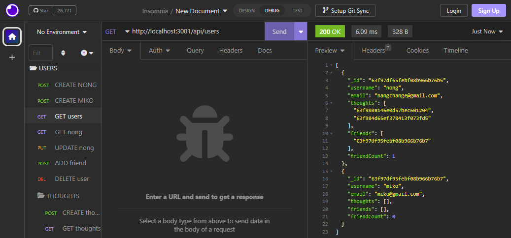
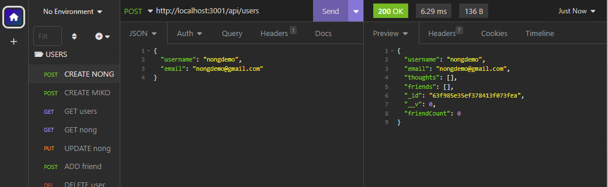

# **tech-blog**

> This repository utilizes MongoDB, Insomnia, and Express to create the back-end for a Social Media network API. The current functionality of the repository allows one to create, update, and delete users, add other users as friends, and post, update, and delete content.

## **Table of Contents**

- [**tech-blog**](#tech-blog)
  - [**Table of Contents**](#table-of-contents)
  - [**Features**](#features)
  - [**Installation**](#installation)
  - [**Usage Instructions**](#usage-instructions)
  - [Questions](#questions)
  - [Credits](#credits)

## **Features**
The deployed application and repository contains the following features:

- Makes use of MongoDB and Mongoose to handle a noSQL database.
- Configuration files connections MongoDB or local databases to Insomnia.
- Data-types for Users, Thoughts, and Reactions are constructed as models with defined data-types.
- Controllers define API routes for GET, POST, PUT, and DELETE routes in retrieving, publishing, updating, and removing data.

## **Installation**

Copy the HTTPS or SSH key into your terminal and perform a git pull to create a local copy of the repository. A copy of this repository can be cloned using either of the following codes in the terminal to create a copy in your local environment:

**HTTPS**: 
> `https://github.com/christiangella/social-network-api.git`

**SSH**:
> `git@github.com:christiangella/social-network-api.git`

## **Usage Instructions**

A demonstration of the application can be viewed by [clicking here](git@github.com:christiangella/social-network-api.git).

To deploy the application from your local environment, first clone a copy of the repository. Once the repository has been downloaded, navigate to the repository in the terminal and install the necessary third-party packages using `npm i` or `npm install`. 

In the command line terminal, deploy the application locally by running either `npm start` or `node index.js`. This will deploy the repository to your local host at http://localhost:3001/.

The database can be accessed through Insomnia to test GET, POST, PUT, and DELETE routes.

GET requests can be made to `/api/users` and `/api/thoughts`. By referencing a specific ID, single-object queries can be made to fetch specific data.

POST requests can be made at any of these categories by seeding data into the request body, provided they match the model data-types.

PUT requests can be made by referencing an ID and seeding data into the request body.

DELETE requests can be made by referencing an ID.

## Questions

This repository was created by Manong Chris. For further support, reach out by email at christian.gella@gmail.com or by Github at christiangella.

## Credits

This repository was developed for the UC Davis Fullstacks Bootcamp under the UC Davis Continuing and Professional Education.
